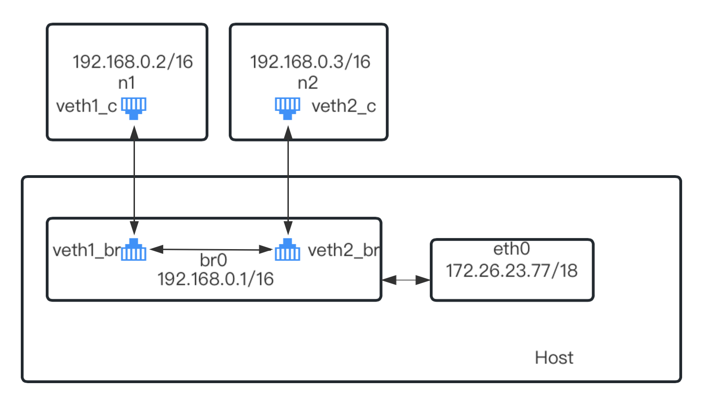

# Tiny-Docker
   Tiny Docker是一个使用Golang语言实现的精简版Docker项目，旨在模仿runC实现容器管理的基本功能。该项目采用了CS架构，客户端和服务器使用GRPC框架进行交互。可以实现高效的容器远程管理。  
   

# 核心功能目录
## 一、容器
- [启动容器](#启动容器) 
- [进入容器](#进入容器) 
- [执行容器命令](#执行容器命令)
- [查看运行中的容器](#查看运行中的容器)
- [删除容器](#删除容器)
## 二、资源限制
- [cpu资源限制](#cpu资源限制)
- [memory资源限制](#mem资源限制)
## 三、容器卷挂载
- [aufs文件系统](#aufs)
- [overlay文件系统](#overlay)
## 四、网络配置
- [1、网络配置基本原理](#网络配置基本原理)
  - [bridge](#bridge)
- [2、网络管理](#创建网络)
  - [create](#nw_create)
  - [list](#nw_list)
  - [delete](#nw_delete)

# 核心功能实现
## 一、容器 
### 1、启动容器 <a id="启动容器"></a>
> 首先先启动一个容器看看效果

```shell
$ ./tinyd run --help

NAME:
   tinyd run - run a new container

USAGE:
   tinyd run [command options] [arguments...]

OPTIONS:
   --it          enable tty
   -v value      mount volume -- vol1 : vol2
   -i value      containe image's id
   --net value   set container name
   -p value      HostPort:ContainerPort
   --name value  set container name
   --cpu value   limit the use of cpu
   --mem value   limit the use of mem
```
- --it   代表是否进入交互逻辑
- --v    进行容器卷挂载
- -i     指定容器镜像的id
- --net  指定容器启动时需要加入的网络默认为Tiny-docker,Bridge类型
- -p     端口映射
- --name 设置容器的名字
- --cpu  对容器使用cpu进行限制,范围为[10000,100000],最大为100000代表100%的cpu资源
- --mem  对容器使用mem进行限制,如--mem 100m 表示使用100Mi内存

```shell
#启动一个容器
$ ./tinyd run -i /root/redis --cpu 10000 --mem 500m --name c1 -p 8080:80 /bin/sleep 3000
Create ContainerId 68d19c54 Sucessfully
$ ./tinyd ps
CONTAINER ID    IMAGE      COMMAND         CREATED         STATUS     PORTS      VOLUME               NAMES
68d19c54        /root/redis /bin/sleep 3000  14:49           RUNNING    8080:80;     -                  c1
```
> 可以看到容器已经成功运行,接下来我们看创建一个容器发生了什么

1. ./client/cli_command.go文件中定一个执行命令行tinyd run所接收的字段
```go
// 用于启动一个容器
var run = cli.Command{
	Name:  "run",
	Usage: `run a new container`,
	Flags: []cli.Flag{...},
	Action: func(context *cli.Context) error {
    ...
		err := cmd.RunCommand(context)
    ...
	},
}
```
2. run命令将全部接收的数据传递给cmd.RunCommand,RunCommand解析出所有的字段封装为一个请求并通过GRPC远程调用调用服务器的RunContainer()函数
```go
func RunCommand(ctx *cli.Context) error {
	//解析出设定的配置
	req := &cmdline.Request{
		Args: &cmdline.Flag{
			It:      ctx.Bool("it"),
			ImageId: ctx.String("i"),
			Net:     ctx.String("net"),
			Name:    ctx.String("name"),
			Cpu:     ctx.String("cpu"),
			Mem:     ctx.String("mem"),
			Volmnt:  ctx.StringSlice("v"),
			Ports:   ctx.StringSlice("p"),
		},
		Cmd: ctx.Args(),
	}
	client, err := conn.GrpcClient_Single()
	if err != nil {
		return fmt.Errorf("\nclient创建失败 : %v", err)
	}
	response, err := client.RunContainer(context.Background(), req)
  ...
}
```
3. 服务器执行的RunContainer()在./server/service/containerSVC.go中
```go
func (r *ContainerService) RunContainer(ctx context.Context, req *cmdline.Request) (*cmdline.RunResponse, error) {
	//实现具体的业务逻辑
	newContainer, err := container.CreateContainer(req) //实例化一个容器
	if err != nil {
		return &cmdline.RunResponse{}, err //容器配置有误
	}
	if err := newContainer.Init(); err != nil { //初始化容器
		return &cmdline.RunResponse{
			ContainerId: "", //容器创建失败返回空
		}, err
	}
	container.Global_ContainerMap[newContainer.ContainerId] = newContainer //放入Global_ContainerMap
	return &cmdline.RunResponse{
		ContainerId: newContainer.ContainerId, //容器创建成功返回真实的容器id
	}, nil
}
```
4. RunContainer()调用container.CreateContainer(req)去创建一个容器的数据结构也就是实例化一个容器
```go
// 容器的数据结构
type Container struct {
	ContainerId  string               //容器的唯一标识
	Name         string               //容器的自定义名称
	CgroupRes    conf.Cgroupflag      //cgroup资源
	NameSpaceRes *syscall.SysProcAttr //Namespace隔离标准当作克隆标志
	RealPid      int                  //容器在主机上真实的进程id
	Volmnt       map[string]string    //挂载卷映射 [host]->container
	CreateTime   string               //创建时间
	Status       state                //容器的运行状态
	Image        string               //容器镜像
	Command      string               //启动命令
	Net          ContainerNet         //容器网络
}
```
对于以上字段的所有配置都在CreateContainer()中完成，回到RunContainer()拿到一个newContainer,newContainer调用自身的Init()方法完成容器的启动，容器在启动的过程中会读取容器配置的的数据。完成启动以后返回客户端一个容器的ID号作为容器的标识。  

以上就是创建一个容器所进行的流程，关于具体的容器启动过程中如何配置，下面阐述。  

> 让深入容器启动时,是如何配置的？我通过代码注释的方式详细解释

```go
// 容器相关配置初始化，例如namesapce和cgroup
func (c *Container) Init() error {
	//1.加载容器镜像挂载overlay存储
  /* 
  也就是说通过overlay的挂载方式，将容器镜像放到一个目录下(/mnt/tiny-docker/<container-id>),我们改变容器进程的根目录为/mnt/tiny-docker/<container-id>,让在容器中的所有进程都以为自己在一个全新的文件系统中，并且对文件的修改不会影响到宿主机，从而实现文件系统的隔离
  */
	image_path := c.Image
	err := overlayfs.MountOverlay(image_path, c.ContainerId)
	if err != nil {
		fmt.Println("overlayfs mount err = ", err)
		return err
	}
	//2.挂载容器卷
  /* 
      这个用于实现容器卷的挂载vol1:vol2,将宿主机的文件vol1挂载到容器文件系统的vol2
  */
	if c.Volmnt != nil {
		err = overlayfs.MountFS(c.Volmnt, c.ContainerId)
		if err != nil {
			fmt.Println("volume mount err = ", err)
			return err
		}
	}

	//3.从挂载好的overlay存储中启动容器
	os.Chdir("/root/go/tiny-docker/container/lib") //钩子程序的位置
	//如果容器指定的网络是host，那么就没有必要隔离网络命名空间,这里给容器启动钩子传递一个标记
	var netflag string
	if _, ok := c.Net.Network_Membership.Driver.(*network.HostDriver); ok {
		//如果是host驱动
		netflag = "host"
	}
  /*
    ./task是一个容器启动的钩子程序，之所以需要借助一个额外的程序是因为我们要先创建一个全新的命名空间(Mount、UTS、IPC、PID、Network、User)实现与宿主机的完全隔离，如果我们在本程序中创建新的namespace那么本程序就会进入这个新的namespace，无法实现容器与宿主机隔离。所以我们借助一个钩子程序去创建一个新的namespace，然后钩子程序再启动容器。这样就实现完美隔离了。
  */
	cmd := exec.Command("./task", c.ContainerId, c.Command, netflag) //启动容器的钩子+容器名+第一条启动命令
	r, w, _ := os.Pipe()                                             //用于跟这个钩子程序通信
	cmd.ExtraFiles = []*os.File{w}                                   //将管道的一端传递给钩子
	if err := cmd.Start(); err != nil {
		fmt.Println("cmd err = ", err)
		return err
	}

  /*
    钩子程序启动了容器进程，获取这个进程号，并通过管道将这个pid传递给主程序用于主程序对容器的管理
  */
	buf := make([]byte, 1024)
	n, _ := r.Read(buf)
	r.Close()
	pid, _ := strconv.Atoi(string(buf[:n-1])) //钩子程序用于容器的启动，并从管道的另一端返回容器启动的真实pid
	c.RealPid = pid

	//4.创建cgroup资源
	//容器内的第一个程序已经启动，针对这个容器以他的唯一标识container_id在/sys/fs/cgroup/<subsystem>/tiny-docker/<container_id>创建新的subsystem
  /*
    创建cgroup子系统，并根据容器的cpu和mem配置修改子系统中的配置文件，并将容器的pid加入到对应资源子系统的task中，容器的运行就会受到资源的限制。
  */
	if err := cgroup.SetCgroup(c.ContainerId, &c.CgroupRes, c.RealPid); err != nil {
		KillContainer(c)
		return fmt.Errorf("cgroup资源配置出错 :%v", err)
	}

	//5.配置网络资源
  /*
    很简单，获得一个具体的IP地址。细节在网络实现的部分会细讲
  */
	c.Net.Ip, err = network.ApplyNetwork(c.RealPid, c.Net.Network_Membership, c.Net.Port)
	if err != nil {
		KillContainer(c)
		return fmt.Errorf("网络配置出错 :%v", err)
		//清除网络配置
	}
	//cmd.Wait()
	return nil
}
```
基于以上大体流程，我们就完完全全启动了一个命名空间隔离、资源隔离、文件系统隔离的容器。大体流程如此，关于其中具体的实现细节，下面还会解释。


### 1、网络配置基本原理 
<a id="网络配置基本原理"></a>
### bridge网络
<a id="bridge"></a> 
    
  上图是bridge网络的核心结构。虚拟网卡对veth一端接收数据会从另一端流出。对于主机网络和n1、n2，三者之间是隔离的，因此借助虚拟网卡的特性才能进行数据交互。并且不同命名空间的网络也不在同一个网段下。也需要借助路由转发技术实现不同网段的数据交互，此时主机可以看作是一个路由器。需要在主机上打开路由转发功能。  
  临时生效  
```sh 
$ echo "1" > /proc/sys/net/ipv4/ip_forward 
```

永久生效,修改 /etc/sysctl.conf：
```sh 
$ net.ipv4.ip_forward = 1
```
以下对整个bridge网络进行一个实操,完成整个实验会对bridge网络有个深刻的理解
```shell
$ #新建网络命名空间n1、n2 和网桥 br0
$ ip netns add n1 
$ ip netns add n2 
$ brctl addbr br0
$ #新建两对虚拟网卡
$ ip link add veth1_br type veth peer name veth1_c
$ ip link add veth2_br type veth peer name veth2_c
$ #将网卡的一端放入网络命名空间n1、n2
$ ip link set veth1_c netns n1     
$ ip link set veth2_c netns n2  
$ #将网卡的一端放入网桥br0
$ ip link set veth1_br master br0
$ ip link set veth2_br master br0
$ #给网桥设置ip地址和广播地址，并启动up
$ ip addr add 192.168.0.1/16 brd + dev br0 
$ ip link set br0 up
$ ip netns exec n1 ip addr add 192.168.0.2/16 dev veth1_c
$ #给放入命名空间n1、n2的网卡设置ip地址，并启动up
$ ip netns exec n1 ip addr add 192.168.0.2/16 brd + dev veth1_c
$ ip netns exec n1 ip link set veth1_c up
$ ip netns exec n2 ip addr add 192.168.0.3/16 brd + dev veth2_c
$ ip netns exec n2 ip link set veth2_c up
$ #启动虚拟网卡的另一端
$ ip link set veth1_br up
$ ip link set veth2_br up

$ #以上设置完成以后，在192.168.0.0/16这个网段中的 n1 n2 br0都是可以互相通信的
$ ip netns exec n1 ping -c 1 192.168.0.3
PING 192.168.0.3 (192.168.0.3) 56(84) bytes of data.
64 bytes from 192.168.0.3: icmp_seq=1 ttl=64 time=0.185 ms

--- 192.168.0.3 ping statistics ---
1 packets transmitted, 1 received, 0% packet loss, time 0ms
rtt min/avg/max/mdev = 0.185/0.185/0.185/0.000 ms
$ ip netns exec n2 ping -c 1 192.168.0.2
PING 192.168.0.2 (192.168.0.2) 56(84) bytes of data.
64 bytes from 192.168.0.2: icmp_seq=1 ttl=64 time=0.081 ms

--- 192.168.0.2 ping statistics ---
1 packets transmitted, 1 received, 0% packet loss, time 0ms
rtt min/avg/max/mdev = 0.081/0.081/0.081/0.000 ms
```
> 注意，此时n1、n2网络命名空间是不可以上外网，外网也无法访问n1、n2;  
> 需要访问外网和提供服务需要配置路由表和iptables流量转发  

**实现访问外网**  
原理是iptables中nat表中SNAT功能，SNAT 可以在出站数据包经过网络设备时修改其源IP地址，使其看起来像来自于网络设备的另一个IP地址。这对于将内部私有 IP地址转换为公共IP地址非常有用，以便与外部网络通信。  
格式:`iptables -t nat -A POSTROUTING -s <源 IP 地址范围> -j SNAT --to-source <目标 IP 地址>`  
如果我们不能确定需要转换的公网地址可以简单一点让iptables动态的去检测网关IP地址  
`iptables -t nat -A POSTROUTING -s <源IP地址> -j MASQUERADE`  

```shell
$ #进入网络命名空间内部设置默认网关
$ ip netns exec n1 ip route add default via 192.168.0.1 dev veth1_c
$ ip netns exec n2 ip route add default via 192.168.0.1 dev veth2_c
$ ip netns exec n1 route -n
Kernel IP routing table
Destination     Gateway         Genmask         Flags Metric Ref    Use Iface
0.0.0.0         192.168.0.1     0.0.0.0         UG    0      0        0 veth1_c
192.168.0.0     0.0.0.0         255.255.0.0     U     0      0        0 veth1_c

$ #现在在n1、n2网络中是无法访问www.baidu.com
$ #需要设置SNAT转发
$ iptables -t nat -A POSTROUTING -s 192.168.0.0/16 -j MASQUERADE
$ ip netns exec n1 ping www.baidu.com
PING www.a.shifen.com (180.101.50.188) 56(84) bytes of data.
64 bytes from 180.101.50.188 (180.101.50.188): icmp_seq=1 ttl=49 time=9.60 ms
64 bytes from 180.101.50.188 (180.101.50.188): icmp_seq=2 ttl=49 time=9.57 ms
64 bytes from 180.101.50.188 (180.101.50.188): icmp_seq=3 ttl=49 time=9.62 ms
^C
--- www.a.shifen.com ping statistics ---
3 packets transmitted, 3 received, 0% packet loss, time 5ms
rtt min/avg/max/mdev = 9.566/9.593/9.616/0.020 ms
```
> 注意，当新启动一个容器镜像的时候虽然所有的网络配置都正确，但是也不一定可以访问www.baidu.com,这是因为容器内部的域名解析配置不正确，如果出现这种情况请检查容器的/etc/resolve.conf。最简单的做法是直接复制主机的/etc/resolve.conf


## **1.容器根文件系统挂载实现**
<a id="section1"></a>
以下对功能实现的原理做举例说明

1、获得一个redis的完整工作目录
```shell
[root@haohao ~]# docker run -d redis:latest sleep 300
9c664a921a275e5d1b31fc395ef3d4f9734b06a75cef331aeda4cca073052cb6
[root@haohao ~]# docker ps
CONTAINER ID   IMAGE          COMMAND                  CREATED         STATUS         PORTS      NAMES
9c664a921a27   redis:latest   "docker-entrypoint.s…"   4 seconds ago   Up 2 seconds   6379/tcp   friendly_mcclintock
[root@haohao ~]# docker export -o redis.tar 9c664a921a27
[root@haohao ~]# mkdir redis
[root@haohao ~]# tar -xvf redis.tar -C ~/redis
[root@haohao ~]# cd redis/
[root@haohao redis]# ls
bin  boot  data  dev  etc  home  lib  lib64  media  mnt  opt  proc  root  run  sbin  srv  sys  tmp  usr  var
[root@haohao redis]# pwd
/root/redis
```
2、使用overlay挂载方式挂载redis工作目录
```shell
[root@haohao redis]# mkdir -p /mnt/redis/{merge,work,upper}
[root@haohao redis]# cd /mnt/redis/
[root@haohao redis]# tree .
        .
        ├── merge //合并层
        ├── upper //读写层
        └── work  //工作层
[root@haohao redis]# mount -t overlay redis-overlay -o lowerdir=/root/redis,upperdir=/mnt/redis/upper,workdir=/mnt/redis/work merge
[root@haohao redis]# mount
redis-overlay on /mnt/redis/merge type overlay (rw,relatime,lowerdir=/root/redis,upperdir=/mnt/redis/upper,workdir=/mnt/redis/work)
#说明已经将redis工作目录作为只读层以overlay的方式挂载到了/mnt/redis/中
[root@haohao redis]# tree . -L 2
        .
        ├── merge
        │   ├── bin
        │   ├── boot
        │   ├── data
        │   ├── dev
        │   ├── etc
        │   ├── home
        │   ├── lib
        │   ├── lib64
        │   ├── media
        │   ├── mnt
        │   ├── opt
        │   ├── proc
        │   ├── root
        │   ├── run
        │   ├── sbin
        │   ├── srv
        │   ├── sys
        │   ├── tmp
        │   ├── usr
        │   └── var
        ├── upper
        └── work
            └── work
24 directories, 0 files
```
将`/mnt/redis/merge`作为容器的根文件系统目录`/`，从`/`这里启动容器，既可以做到不影响容器镜像的前提下进行读写
具体实现见`container`、`overlayfs`包

## **2.容器卷挂载的实现**
容器的根文件系统挂载在`/mnt/redis/merge`,那么在容器启动之前，根文件系统挂载完成以后，我们可以先把需要挂载的卷挂载到指定目录
例如我们需要把`/root/vol`挂载到容器中的`/root/vol`
核心实现是直接挂载
`mount --bind src target`

`mount --bind` 命令是 Linux 系统中的一个命令，它的作用是将一个目录挂载到另一个目录上，从而让这两个目录共享同一个文件系统。这个过程也被称为“绑定挂载”（bind mount）。

具体来说，`mount --bind` 命令可以将一个目录（源目录）挂载到另一个目录（目标目录）上，使得目标目录中的文件和源目录中的文件指向同一块磁盘空间。这样，如果你在目标目录中创建、修改或删除文件，相应的操作也会反映在源目录中。

绑定挂载通常被用来实现以下功能：

- 将一个目录的内容复制到另一个目录中；
- 将一个目录挂载到另一个目录上，并以只读方式访问；
- 将一个目录挂载到另一个目录上，并以可写方式访问。

需要注意的是，`mount --bind` 命令只能在 Linux 系统中使用，并且需要在 root 权限下执行。

`举例`
```shell
[root@haohao vol]# pwd
/root/vol
[root@haohao vol]# tree .
        .
        ├── a.txt
        ├── b.txt
        ├── test1
        │   ├── a.txt
        │   └── ok.txt
        └── test2
[root@haohao vol]# mount --bind /root/vol /mnt/redis/merge/root/vol
mount: /mnt/redis/merge/root/vol: mount point does not exist.
[root@haohao vol]# mkdir /mnt/redis/merge/root/vol
[root@haohao vol]# mount --bind /root/vol /mnt/redis/merge/root/vol
[root@haohao root]# pwd
/mnt/redis/merge/root
[root@haohao root]# tree .
        .
        └── vol
            ├── a.txt
            ├── b.txt
            ├── test1
            │   ├── a.txt
            │   └── ok.txt
            └── test2
```
## **3.exec执行容器命令实现**
一个核心的命令就是`nsenter --all -t <pid> <cmd>`  
举例`nsenter --all -t 12233 ls`即可进入pid为12233的程序的所有命名空间执行ls命令  

***主要流程***  
1.客户端执行命令`tiny-docker exec <containerId> <cmd>`[cmd/ExecCommand.go]  
2.向服务器发起`ExecContainer()远程调用`[server/execContainer.go]  
3.ExecContainer()会根据请求的容器id和需要执行的命令调用`nsenter --all -t <pid> <cmd>`并重定向此程序的`STDOUT、STDERR`并返回给客户端。