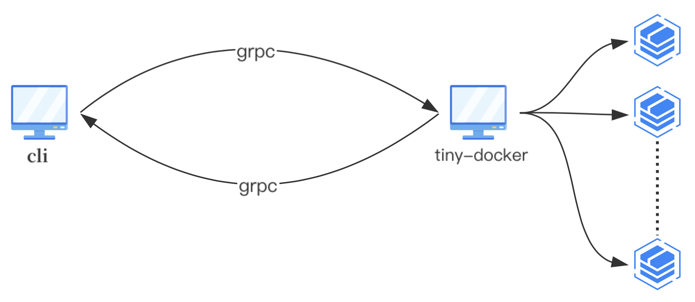

# Tiny-Docker
   Tiny Docker是一个使用Golang语言实现的精简版Docker项目，旨在模仿runC实现容器管理的基本功能。该项目采用了CS架构，客户端和服务器使用GRPC框架进行交互。可以实现高效的容器远程管理。  
   

# 核心功能实现简要讲解
## 容器
- [启动容器](#启动容器) 
    - [xxx](#xxx)
    - [xxx](#xxx)
- [进入容器](#进入容器) 
    - [xxx](#xxx)
    - [xxx](#xxx)
- [执行容器命令](#执行容器命令)
    - [xxx](#xxx)
    - [xxx](#xxx)
- [查看运行中的容器](#查看运行中的容器)
    - [xxx](#xxx)
    - [xxx](#xxx)
- [删除容器](#删除容器)
    - [xxx](#xxx)
## 资源限制
- [cpu资源限制](#cpu资源限制)
- [memory资源限制](#mem资源限制)
## 容器卷挂载
- [aufs文件系统](#aufs)
- [overlay文件系统](#overlay)
## 网络配置
- [网络配置基本原理](#网络配置基本原理)
- [网络管理](#创建网络)
  - [create](#nw_create)
  - [list](#nw_list)
  - [delete](#nw_delete)
## **1.容器根文件系统挂载实现**
<a id="section1"></a>
以下对功能实现的原理做举例说明

1、获得一个redis的完整工作目录
```shell
[root@haohao ~]# docker run -d redis:latest sleep 300
9c664a921a275e5d1b31fc395ef3d4f9734b06a75cef331aeda4cca073052cb6
[root@haohao ~]# docker ps
CONTAINER ID   IMAGE          COMMAND                  CREATED         STATUS         PORTS      NAMES
9c664a921a27   redis:latest   "docker-entrypoint.s…"   4 seconds ago   Up 2 seconds   6379/tcp   friendly_mcclintock
[root@haohao ~]# docker export -o redis.tar 9c664a921a27
[root@haohao ~]# mkdir redis
[root@haohao ~]# tar -xvf redis.tar -C ~/redis
[root@haohao ~]# cd redis/
[root@haohao redis]# ls
bin  boot  data  dev  etc  home  lib  lib64  media  mnt  opt  proc  root  run  sbin  srv  sys  tmp  usr  var
[root@haohao redis]# pwd
/root/redis
```
2、使用overlay挂载方式挂载redis工作目录
```shell
[root@haohao redis]# mkdir -p /mnt/redis/{merge,work,upper}
[root@haohao redis]# cd /mnt/redis/
[root@haohao redis]# tree .
        .
        ├── merge //合并层
        ├── upper //读写层
        └── work  //工作层
[root@haohao redis]# mount -t overlay redis-overlay -o lowerdir=/root/redis,upperdir=/mnt/redis/upper,workdir=/mnt/redis/work merge
[root@haohao redis]# mount
redis-overlay on /mnt/redis/merge type overlay (rw,relatime,lowerdir=/root/redis,upperdir=/mnt/redis/upper,workdir=/mnt/redis/work)
#说明已经将redis工作目录作为只读层以overlay的方式挂载到了/mnt/redis/中
[root@haohao redis]# tree . -L 2
        .
        ├── merge
        │   ├── bin
        │   ├── boot
        │   ├── data
        │   ├── dev
        │   ├── etc
        │   ├── home
        │   ├── lib
        │   ├── lib64
        │   ├── media
        │   ├── mnt
        │   ├── opt
        │   ├── proc
        │   ├── root
        │   ├── run
        │   ├── sbin
        │   ├── srv
        │   ├── sys
        │   ├── tmp
        │   ├── usr
        │   └── var
        ├── upper
        └── work
            └── work
24 directories, 0 files
```
将`/mnt/redis/merge`作为容器的根文件系统目录`/`，从`/`这里启动容器，既可以做到不影响容器镜像的前提下进行读写
具体实现见`container`、`overlayfs`包

## **2.容器卷挂载的实现**
容器的根文件系统挂载在`/mnt/redis/merge`,那么在容器启动之前，根文件系统挂载完成以后，我们可以先把需要挂载的卷挂载到指定目录
例如我们需要把`/root/vol`挂载到容器中的`/root/vol`
核心实现是直接挂载
`mount --bind src target`

`mount --bind` 命令是 Linux 系统中的一个命令，它的作用是将一个目录挂载到另一个目录上，从而让这两个目录共享同一个文件系统。这个过程也被称为“绑定挂载”（bind mount）。

具体来说，`mount --bind` 命令可以将一个目录（源目录）挂载到另一个目录（目标目录）上，使得目标目录中的文件和源目录中的文件指向同一块磁盘空间。这样，如果你在目标目录中创建、修改或删除文件，相应的操作也会反映在源目录中。

绑定挂载通常被用来实现以下功能：

- 将一个目录的内容复制到另一个目录中；
- 将一个目录挂载到另一个目录上，并以只读方式访问；
- 将一个目录挂载到另一个目录上，并以可写方式访问。

需要注意的是，`mount --bind` 命令只能在 Linux 系统中使用，并且需要在 root 权限下执行。

`举例`
```shell
[root@haohao vol]# pwd
/root/vol
[root@haohao vol]# tree .
        .
        ├── a.txt
        ├── b.txt
        ├── test1
        │   ├── a.txt
        │   └── ok.txt
        └── test2
[root@haohao vol]# mount --bind /root/vol /mnt/redis/merge/root/vol
mount: /mnt/redis/merge/root/vol: mount point does not exist.
[root@haohao vol]# mkdir /mnt/redis/merge/root/vol
[root@haohao vol]# mount --bind /root/vol /mnt/redis/merge/root/vol
[root@haohao root]# pwd
/mnt/redis/merge/root
[root@haohao root]# tree .
        .
        └── vol
            ├── a.txt
            ├── b.txt
            ├── test1
            │   ├── a.txt
            │   └── ok.txt
            └── test2
```
## **3.exec执行容器命令实现**
一个核心的命令就是`nsenter --all -t <pid> <cmd>`  
举例`nsenter --all -t 12233 ls`即可进入pid为12233的程序的所有命名空间执行ls命令  

***主要流程***  
1.客户端执行命令`tiny-docker exec <containerId> <cmd>`[cmd/ExecCommand.go]  
2.向服务器发起`ExecContainer()远程调用`[server/execContainer.go]  
3.ExecContainer()会根据请求的容器id和需要执行的命令调用`nsenter --all -t <pid> <cmd>`并重定向此程序的`STDOUT、STDERR`并返回给客户端。